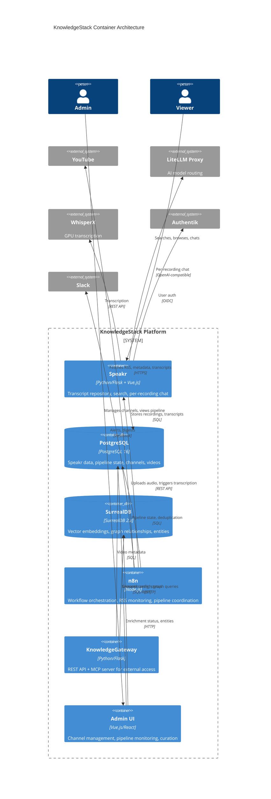
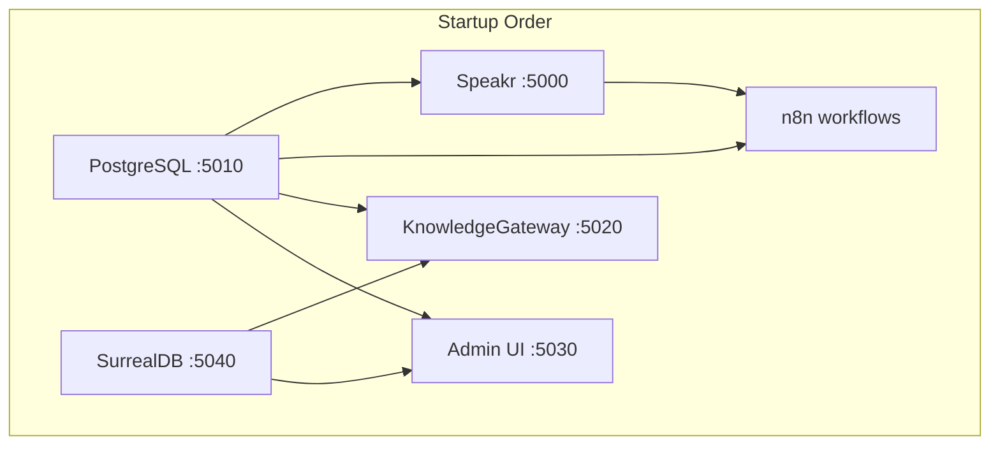

# Container Architecture (C4 Level 2)

**Last Updated:** 2026-03-22

## Container Diagram



## Containers Overview

### Core Application Containers

| Container | Technology | Port | Purpose |
|-----------|------------|------|---------|
| **Speakr** | Python 3.11 / Flask + Vue.js 3 | 5000 | Transcript repository, search, per-recording AI chat |
| **PostgreSQL** | PostgreSQL 16 | 5010 | Primary relational data - Speakr data, pipeline state |
| **SurrealDB** | SurrealDB 2.x | 5040 | Vector embeddings, graph relationships, entities |
| **n8n** | Node.js | (Helicarrier) | Workflow orchestration, RSS monitoring |
| **KnowledgeGateway** | Python/Flask | 5020 | REST API + MCP server (Vision phase) |
| **Admin UI** | Vue.js/React | 5030 | Channel management, pipeline monitoring (Growth phase) |

### Infrastructure Containers

| Container | Technology | Host | Purpose |
|-----------|------------|------|---------|
| **LiteLLM Proxy** | Python | Helicarrier (10.0.0.27:2764) | AI model routing, embedding generation |
| **WhisperX** | Python + CUDA | Jarvis | GPU-accelerated transcription |
| **Authentik** | Python/Django | Helicarrier | OIDC identity provider |
| **Grafana** | Go | Coulson | Dashboards, visualization |
| **Loki** | Go | Coulson | Log aggregation |
| **Prometheus** | Go | Coulson | Metrics collection |

## Container Communication

### Synchronous (REST/SQL)

```
┌─────────────────────────────────────────────────────────────┐
│                         Banner (10.0.0.33)                  │
│                                                             │
│   ┌──────────┐     SQL     ┌────────────┐                  │
│   │  Speakr  │◄───────────►│ PostgreSQL │                  │
│   │  :5000   │             │   :5010    │                  │
│   └────┬─────┘             └─────┬──────┘                  │
│        │                         │                          │
│        │                         │ SQL (pipeline state)     │
│        │                         │                          │
│   ┌────▼─────────────────────────▼─────┐                   │
│   │           SurrealDB :5040          │                   │
│   │    (vectors, graph, entities)      │                   │
│   └────────────────────────────────────┘                   │
└─────────────────────────────────────────────────────────────┘
                    │ HTTP
                    ▼
┌─────────────────────────────────────────────────────────────┐
│                    Helicarrier (10.0.0.27)                  │
│   ┌─────────┐              ┌─────────────┐                 │
│   │   n8n   │              │ LiteLLM     │                 │
│   │  :5678  │              │   :2764     │                 │
│   └────┬────┘              └─────────────┘                 │
└────────┼────────────────────────────────────────────────────┘
         │ HTTPS
         ▼
    ┌──────────┐
    │ YouTube  │
    │ RSS/API  │
    └──────────┘
```

### Asynchronous (Events/Webhooks)

| Source | Target | Trigger | Payload |
|--------|--------|---------|---------|
| n8n | Slack | Pipeline failure | Error details, retry link |
| n8n | Slack | Daily digest | Channel status summary |
| Speakr | n8n (webhook) | Transcription complete | Recording ID, status |
| SurrealDB | n8n (webhook) | Embedding complete | Segment IDs |

## Data Storage

### PostgreSQL Schema (Speakr + Pipeline)

```
┌─────────────────────────────────────────────────────────────┐
│ PostgreSQL - Primary Relational Store                       │
├─────────────────────────────────────────────────────────────┤
│ SPEAKR TABLES (upstream, unmodified)                        │
│   recordings, transcripts, users, tags, bookmarks, etc.     │
├─────────────────────────────────────────────────────────────┤
│ PIPELINE TABLES (our additions)                             │
│   channels          - monitored YouTube channels            │
│   channel_config    - per-channel settings (tier, mode)     │
│   pipeline_items    - 11-state ingestion tracking           │
│   failed_items      - dead letter queue                     │
│   sync_status       - n8n execution logs                    │
└─────────────────────────────────────────────────────────────┘
```

### SurrealDB Schema (Intelligence Layer)

```
┌─────────────────────────────────────────────────────────────┐
│ SurrealDB - Vector + Graph Store                            │
├─────────────────────────────────────────────────────────────┤
│ NODES                                                       │
│   channel, video, segment, speaker, topic, quote            │
│   persona_agent, golden_standard, project                   │
├─────────────────────────────────────────────────────────────┤
│ EDGES (Relationships)                                       │
│   has_video, has_segment, appears_in, speaks_in, mentions   │
│   references, story_occurrence, project_match               │
├─────────────────────────────────────────────────────────────┤
│ INDEXES                                                     │
│   segment_embedding_idx (HNSW, 1536 dims, cosine)           │
│   topic_normalized_idx, speaker_normalized_idx              │
└─────────────────────────────────────────────────────────────┘
```

## Port Allocation

Following NLF port standard (project block 5000-5099):

| Port | Service | Protocol |
|------|---------|----------|
| 5000 | Speakr Web UI | HTTP |
| 5010 | PostgreSQL | PostgreSQL |
| 5020 | KnowledgeGateway API | HTTP |
| 5030 | Admin UI | HTTP |
| 5040 | SurrealDB HTTP | HTTP |
| 5041 | SurrealDB WebSocket | WS |

## Container Dependencies



## Health Checks

| Container | Endpoint | Expected |
|-----------|----------|----------|
| Speakr | `GET /api/health` | 200 OK |
| PostgreSQL | TCP :5010 | Connection success |
| SurrealDB | `GET /health` | 200 OK |
| n8n | `GET /healthz` | 200 OK |
| LiteLLM | `GET /health` | 200 OK |
| WhisperX | `GET /health` | 200 OK |
