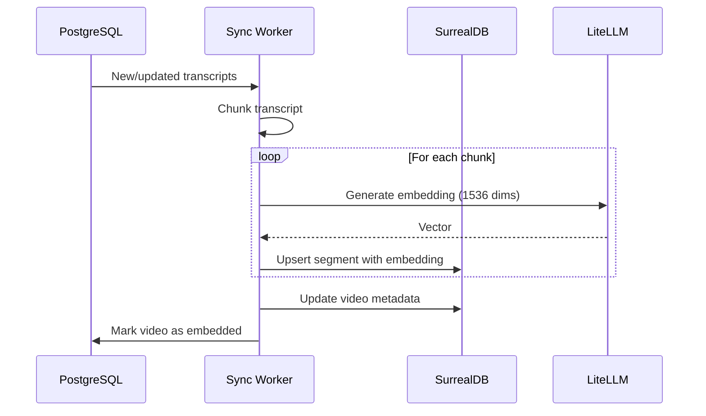
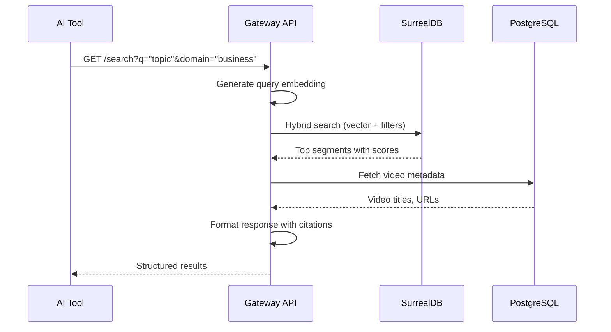

# Data Flow Architecture

**Last Updated:** 2026-03-31 (post-spike update)

## Pipeline Overview

> [Updated 2026-03-31: spike learnings — MCP Gateway replaces yt-dlp/WhisperX, parallel data flow]

```
┌──────────────────────────────────────────────────────────────────────────┐
│                       KnowledgeStack Data Pipeline                        │
├──────────────────────────────────────────────────────────────────────────┤
│                                                                           │
│  DISCOVERY        TRANSCRIPT        STORE (PARALLEL)    ENRICH     SERVE │
│  ─────────────────────────────────────────────────────────────────────── │
│                                                                           │
│  ┌─────────┐    ┌───────────┐    ┌──────────────┐   ┌─────────┐  ┌─────┐│
│  │ RSS     │───►│ MCP       │───►│ SurrealDB    │──►│ Embed   │─►│ API ││
│  │ Monitor │    │ Gateway   │    │ (College)    │   │ + Tag   │  │ MCP ││
│  │ (n8n)   │    │(Helicarr.)│    ├──────────────┤   └─────────┘  └─────┘│
│  └─────────┘    └───────────┘    │ Speakr       │                       │
│       │                          │ (Lecture)    │                       │
│       ▼                          └──────────────┘                       │
│  ┌─────────────────────────────────────────────────────────────────────┐│
│  │                    PostgreSQL (pipeline state)                       ││
│  └─────────────────────────────────────────────────────────────────────┘│
└──────────────────────────────────────────────────────────────────────────┘
```

## Ingestion Pipeline (KnowledgeEnroll)

### 11-State Machine

```
┌───────────────────────────────────────────────────────────────────────────┐
│                                                                            │
│   discovered ──► queued ──► downloading ──► transcribing ──► embedding    │
│        │            │            │              │               │          │
│        │            │            │              │               ▼          │
│        │            │            │              │          indexing        │
│        │            │            │              │               │          │
│        │            │            │              │               ▼          │
│        │            │            │              │      indexed_light ◄─┐   │
│        │            │            │              │               │      │   │
│        │            │            │              │               ▼      │   │
│        │            │            │              │       indexed_full   │   │
│        │            │            │              │               ▲      │   │
│        │            │            │              │               │      │   │
│        │            │            │              │          upgrading ──┘   │
│        │            │            │              │                          │
│        ▼            ▼            ▼              ▼                          │
│      failed ◄──── failed ◄──── failed ◄────── failed                      │
│   (retry_count++)                                                          │
│        │                                                                   │
│        ▼                                                                   │
│     queued (if retry_count < max)                                          │
│                                                                            │
└───────────────────────────────────────────────────────────────────────────┘
```

### Pipeline Stages

> [Updated 2026-03-31: spike learnings — simplified pipeline, no audio download or WhisperX]

| Stage | Trigger | Action | Output |
|-------|---------|--------|--------|
| **Discovery** | RSS poll (5 min via n8n) | Parse new items from YouTube RSS | `discovered` items in PostgreSQL |
| **Dedup** | New discovery | PostgreSQL ON CONFLICT check | Skip duplicates |
| **Queue** | Passes dedup | Add to processing queue | `queued` item |
| **Claim** | Orchestrator picks up | Atomic claim from PostgreSQL (batch of 5) | `claimed` item |
| **Transcript** | Item claimed | MCP Gateway (Helicarrier:2780) fetches YouTube captions | Raw transcript JSON |
| **Store** | Transcript ready | Parallel: segments to SurrealDB + transcript to Speakr | Data in both stores |
| **Embedding** | Segment stored | Generate 1536-dim vectors via LiteLLM (text-embedding-3-small) | Vectors in SurrealDB |
| **Enrichment** | Embedding complete | kg-gen + spaCy entity extraction | Tags in SurrealDB |

### Deduplication Strategy (6 Layers)

```
┌─────────────────────────────────────────────────────────────────────────┐
│ Layer 0: URL Normalization                                               │
│   Extract youtube_video_id from any URL format (11 patterns)             │
├─────────────────────────────────────────────────────────────────────────┤
│ Layer 1: n8n Pre-Filter (automated triggers only)                        │
│   Remove Duplicates node, 50K history, NOT authoritative                 │
├─────────────────────────────────────────────────────────────────────────┤
│ Layer 2: PostgreSQL Existence Check (all paths)                          │
│   Single source of truth, status-aware, atomic claim via ON CONFLICT     │
├─────────────────────────────────────────────────────────────────────────┤
│ Layer 3: External Service Checks (full mode only)                        │
│   Speakr: check before upload. YouTube: skip if recently refreshed       │
├─────────────────────────────────────────────────────────────────────────┤
│ Layer 4: SurrealDB Deterministic IDs                                     │
│   UUIDv5 from video_id + chunk_index. Upsert is inherently idempotent    │
├─────────────────────────────────────────────────────────────────────────┤
│ Layer 5: Content-Level Dedup (Phase 2+)                                  │
│   content_hash for exact, SimHash/MinHash for near-duplicates            │
└─────────────────────────────────────────────────────────────────────────┘
```

## Transcript Processing

### Fetching Strategy

> [Updated 2026-03-31: spike learnings — MCP Gateway replaces youtube-transcript-api/yt-dlp]

| Priority | Method | Speed | When |
|----------|--------|-------|------|
| Primary | MCP Gateway (Helicarrier:2780/mcp) | ~1-3s | All videos with captions |
| Fallback | Direct YouTube caption fetch | ~1-5s | If MCP Gateway unavailable |
| Last resort | Manual transcript upload | N/A | Videos with NO captions |

**Note:** MCP Gateway is an undocumented dependency on Helicarrier. If it goes down, the pipeline queues items and retries.

### Chunking Strategy

```
┌─────────────────────────────────────────────────────────────────────────┐
│ TRANSCRIPT CHUNKING                                                      │
├─────────────────────────────────────────────────────────────────────────┤
│                                                                          │
│  Raw Transcript (JSON3 with timestamps)                                  │
│  ┌──────────────────────────────────────────────────────────────────┐   │
│  │ {"events": [{"tStartMs": 0, "segs": [{"utf8": "Hello..."}]}]}    │   │
│  └──────────────────────────────────────────────────────────────────┘   │
│                            │                                             │
│                            ▼                                             │
│  ┌──────────────────────────────────────────────────────────────────┐   │
│  │ HYBRID CHUNKING STRATEGY                                         │   │
│  │                                                                   │   │
│  │  1. Chapter markers (if available) → natural breaks              │   │
│  │  2. Semantic boundaries (topic shifts) → AI-detected             │   │
│  │  3. Time-based fallback (2-min chunks) → guaranteed coverage     │   │
│  │                                                                   │   │
│  │  Target: ~500 chars per chunk with overlap                       │   │
│  └──────────────────────────────────────────────────────────────────┘   │
│                            │                                             │
│                            ▼                                             │
│  Segments (with timestamps)                                              │
│  ┌────────────┐ ┌────────────┐ ┌────────────┐ ┌────────────┐           │
│  │ Segment 0  │ │ Segment 1  │ │ Segment 2  │ │ Segment N  │           │
│  │ 0:00-2:15  │ │ 2:00-4:30  │ │ 4:15-6:45  │ │ ...        │           │
│  │ embedding  │ │ embedding  │ │ embedding  │ │ embedding  │           │
│  └────────────┘ └────────────┘ └────────────┘ └────────────┘           │
│                                                                          │
└─────────────────────────────────────────────────────────────────────────┘
```

## Enrichment Pipeline (KnowledgeCollege)

### Embedding Flow



### Entity Extraction Flow

```
┌─────────────────────────────────────────────────────────────────────────┐
│ ENTITY EXTRACTION PIPELINE                                               │
├─────────────────────────────────────────────────────────────────────────┤
│                                                                          │
│  Transcript Text                                                         │
│       │                                                                  │
│       ├─────────────────────────────────┬───────────────────────────┐   │
│       │                                 │                           │   │
│       ▼                                 ▼                           ▼   │
│  ┌──────────┐                    ┌──────────┐              ┌──────────┐│
│  │ SPEAKER  │                    │ TOPIC    │              │ QUOTE    ││
│  │ DETECT   │                    │ EXTRACT  │              │ DETECT   ││
│  └────┬─────┘                    └────┬─────┘              └────┬─────┘│
│       │                               │                         │      │
│       ▼                               ▼                         ▼      │
│  speaker table                   topic table              quote table  │
│  appears_in edges                mentions edges           viral_score  │
│  credibility scores              synonyms                              │
│                                                                          │
└─────────────────────────────────────────────────────────────────────────┘
```

## Query Flow (KnowledgeGateway)

### Semantic Search



### Graph Traversal

```surql
-- Example: Find all segments where a speaker discusses a topic
SELECT
    segment.text,
    segment.start_time,
    video.title,
    video.youtube_id
FROM segment
WHERE <-speaks_in<-speaker.normalized = 'myron-golden'
    AND ->mentions->topic.normalized = 'business-principles'
ORDER BY segment.published_at DESC
LIMIT 20;
```

## Data Synchronization

### Enroll → College + Lecture (Parallel Flow)

> [Updated 2026-03-31: spike learnings — parallel data flow replaces sequential Library → College sync]

| Trigger | Action | Frequency |
|---------|--------|-----------|
| New video discovered | Store segments in SurrealDB + upload to Speakr | Parallel on ingestion |
| Segments stored | Generate embeddings via LiteLLM | On ingestion (MVP-2) |
| Embeddings complete | Run entity extraction (kg-gen + spaCy) | On ingestion or batch |
| Entity refresh | Re-extract all entities | Weekly batch |

### Status Tracking

```
┌─────────────────────────────────────────────────────────────────────────┐
│ pipeline_items (PostgreSQL)                                              │
├─────────────────────────────────────────────────────────────────────────┤
│ youtube_id     │ status           │ retry_count │ last_updated          │
├────────────────┼──────────────────┼─────────────┼───────────────────────┤
│ dQw4w9WgXcQ    │ indexed_full     │ 0           │ 2026-03-22 12:00:00   │
│ abc123xyz      │ embedding        │ 0           │ 2026-03-22 11:55:00   │
│ fail789xyz     │ failed           │ 3           │ 2026-03-22 10:30:00   │
└─────────────────────────────────────────────────────────────────────────┘
```

## Rate Limiting & Throttling

> [Updated 2026-03-31: spike learnings — MCP Gateway limits, actual batch sizes]

| Service | Limit | Strategy |
|---------|-------|----------|
| YouTube Data API | 10,000 units/day | Use playlistItems (1 unit) not search (100 units) |
| MCP Gateway | TBD (Helicarrier shared resource) | Rate limit in n8n orchestrator |
| LiteLLM embeddings | ~100 req/min | Batch 20 texts per request |
| Speakr API | No hard limit | Concurrent upload limit: 5 |
| n8n orchestrator | 5 items per cycle (5-min interval) | Batch claim from PostgreSQL |

## Failure Handling

### Dead Letter Queue

```
Failed items → failed_items table
    │
    ├── retry_count < 3 → Re-queue with exponential backoff
    │
    └── retry_count >= 3 → Slack alert + manual review queue
```

### Recovery Patterns

> [Updated 2026-03-31: spike learnings — MCP Gateway failure added]

| Failure Type | Detection | Recovery |
|--------------|-----------|----------|
| Transcript unavailable | HTTP 404/429 | Mark for retry, wait 1 hour |
| MCP Gateway down | Connection refused / timeout | Queue items, retry when healthy |
| Speakr down | Health check fail | Pause uploads, alert, retry when healthy |
| Embedding timeout | No response 30s | Retry with smaller batch |
| Stale claim | Worker died | Reset after 15 minutes |
| SurrealDB connection lost | Write fails | Retry with exponential backoff |

## Post-Spike Status (2026-03-31)

### Validated Architecture

The spike proved the pipeline works end-to-end with the following actual topology:

| Component | Host | Port | Status |
|-----------|------|------|--------|
| PostgreSQL (pipeline state) | Banner | 5019 | Running |
| SurrealDB (segments + graph) | Banner | 5040 | Running |
| Speakr (transcript UI) | Banner | 5000 | Running |
| Admin API | Banner | 5020 | Running |
| Embedding service | Banner | 5030 | Running |
| Landing page | Banner | 5001 | Running |
| n8n (orchestration) | Helicarrier | 443 | Running |
| MCP Gateway (transcripts) | Helicarrier | 2780 | Running |
| LiteLLM proxy (AI) | Helicarrier | 2764 | Running |
| Traefik (routing) | Helicarrier | 443 | Running |

### Key Architectural Change: Parallel Data Flow

**Original design:** Enroll -> Lecture (Speakr) -> College (SurrealDB) sequentially
**Actual design:** Enroll -> (Lecture + College) in parallel

This means Speakr is the **UI/listening layer**, not the **authoritative data store**. Both stores receive data directly from the ingestion pipeline, and neither depends on the other.
