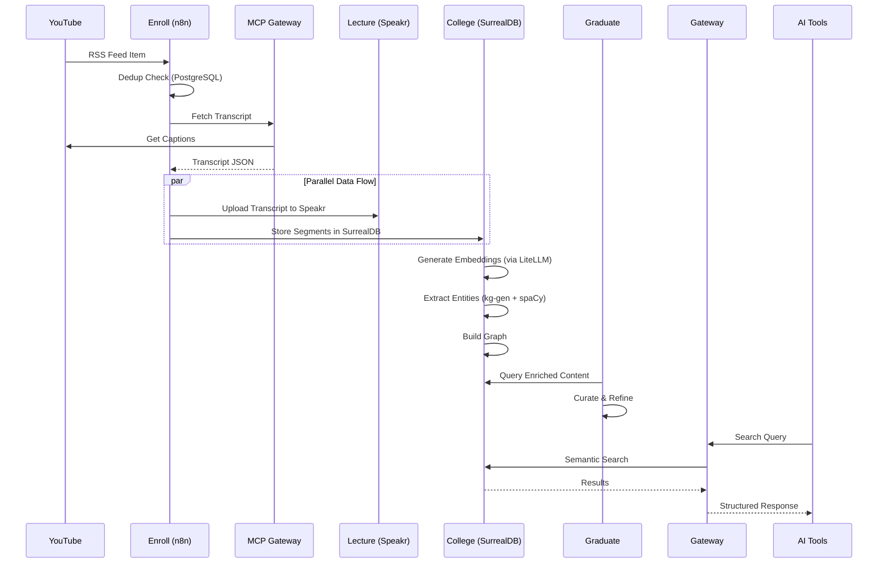

# Platform Products Architecture

**Last Updated:** 2026-03-31 (post-spike update)

## 6-Product Platform Overview

KnowledgeStack is not a single application -- it is a platform composed of 6 distinct products that work together. Each product owns a clear stage of the knowledge pipeline.

```
┌─────────────────────────────────────────────────────────────────────────┐
│                        KnowledgeStack Platform                           │
├─────────────────────────────────────────────────────────────────────────┤
│                                                                          │
│  ┌─────────────┐   ┌─────────────┐   ┌─────────────┐   ┌─────────────┐ │
│  │ TIER 1      │   │ TIER 2      │   │ TIER 3      │   │ TIER 4      │ │
│  │ Enroll      │──►│ Lecture     │──►│ College     │──►│ Graduate    │ │
│  │ (Ingestion) │   │(Lecture Hall)│   │(Intelligence)│   │ (Refinement)│ │
│  └─────────────┘   └─────────────┘   └─────────────┘   └─────────────┘ │
│         │                                                     │         │
│         │                                                     ▼         │
│         │                                             ┌─────────────┐   │
│         │                                             │ TIER 5      │   │
│         │                                             │ Gateway     │   │
│         │                                             │ (Access)    │   │
│         │                                             └─────────────┘   │
│         │                                                     │         │
│         ▼─────────────────────────────────────────────────────▼         │
│                           ┌─────────────┐                               │
│                           │ CROSS-CUT   │                               │
│                           │ Ops         │                               │
│                           │ (Operations)│                               │
│                           └─────────────┘                               │
└─────────────────────────────────────────────────────────────────────────┘
```

## Product Details

### Tier 1: KnowledgeEnroll (Ingestion)

**Purpose:** Monitor YouTube channels, download content, deduplicate, capture metadata

**Technology Stack:**

> [Updated 2026-03-31: spike learnings — MCP Gateway replaces yt-dlp/youtube-transcript-api]

- n8n workflows (orchestration) — 3 workflows deployed
- MCP Gateway (Helicarrier:2780) — transcript fetching
- PostgreSQL (state management, deduplication) — Banner:5019
- Admin API (Banner:5020) — channel management, pipeline monitoring

**Key Responsibilities:**
- Monitor 50 channel RSS feeds on 5-minute intervals
- Fetch transcripts via MCP Gateway (replaces audio download + transcription)
- Capture YouTube metadata (title, description, duration, publish date)
- Deduplicate via PostgreSQL ON CONFLICT + SurrealDB UUIDv5
- Manage pipeline item lifecycle
- Handle failures with retry queue

**Interfaces:**
- **Input:** RSS feeds, YouTube URLs, admin channel configuration
- **Output:** Metadata to PostgreSQL, transcripts to SurrealDB + Speakr (parallel)

**Spike Status (2026-03-31):** RUNNING. 50 channels, 1,017 videos, 95% success rate.

**MVP Scope:**
- Automated ingestion from 50 channels
- New videos appearing in Speakr + SurrealDB within hours of publish
- <5% failure rate per batch run — **achieved**

---

### Tier 2: KnowledgeLecture (Lecture Hall)

**Purpose:** Serve transcripts as listenable/watchable lectures with search and per-recording AI chat

**Technology Stack:**

> [Updated 2026-03-31: spike learnings — WhisperX removed, role clarified as UI/listening layer]

- Speakr (AGPL-3.0, adopted unmodified) — Banner:5000
- Python 3.11 / Flask 2.3.3 + Vue.js 3
- PostgreSQL (via Speakr)
- LiteLLM (per-recording chat)

**Key Responsibilities:**
- Serve as the UI/listening layer (not the authoritative data store)
- Store transcripts with full-text search
- Provide per-recording RAG chat
- Support tagging, bookmarks, playlists
- Handle multi-user access (Authentik OIDC — not yet integrated)
- Serve transcript playback synced to YouTube

**Interfaces:**
- **Input:** Transcripts from Enroll pipeline (parallel with College)
- **Output:** REST API for transcript access, Vue.js UI for viewers

**Spike Status (2026-03-31):** RUNNING at knowledge.nextlevelfoundry.com/lecture/

**Why Speakr:**
Adopting Speakr eliminated ~1 year of UI/auth/search development. KnowledgeStack builds what Speakr doesn't provide (ingestion automation, intelligence layer, operational visibility).

**MVP Scope:**
- 500+ recordings (new + backlog)
- Search returns usable results across 5 domains
- Per-recording chat working

---

### Tier 3: KnowledgeCollege (Intelligence)

**Purpose:** Embed transcripts, enable semantic search, enrich with entities

**Technology Stack:**
- SurrealDB (vector + graph hybrid)
- LiteLLM proxy (embeddings)
- Python scripts (embedding pipeline)

**Key Responsibilities:**
- Generate embeddings for transcript segments (1536 dims)
- Store vectors with HNSW index for similarity search
- Build graph relationships (speaker→video, segment→topic)
- Enable semantic/hybrid search (vector + keyword)
- Extract entities (speakers, topics, organizations)
- Track speaker credibility per domain

**Interfaces:**
- **Input:** Transcripts from Enroll pipeline (parallel with Lecture)
- **Output:** Semantic search API, entity queries, graph traversal

**Key Schema Elements:**
```
NODES: channel, video, segment, speaker, topic, quote, persona_agent, tag
EDGES: has_video, has_segment, appears_in, speaks_in, mentions, references, tagged_with
INDEX: segment_embedding_idx (HNSW, 1536 dims, cosine)
```

**Spike Status (2026-03-31):** DATA LOADED, EMBEDDINGS PENDING.
- 1,017 videos, 83,528 segments in SurrealDB
- 376 tags with Wikidata-grounded hierarchies (kg-gen + spaCy)
- Zero vector embeddings — semantic search blocked
- Tag quality: 95% classified as "concept" — needs tuning

**MVP-2 Scope:**
- Generate embeddings for 83,528 segments (~$2)
- Fix tag quality (products, companies, people not typed correctly)
- Semantic search returning relevant results
- Speaker/topic graph navigable

---

### Tier 4: KnowledgeGraduate (Refinement)

**Purpose:** Curate "golden standard" content, refine knowledge through human review

**Technology Stack:**
- Admin UI (Vue.js/React)
- PostgreSQL (curation metadata)
- SurrealDB (golden_standard table)

**Key Responsibilities:**
- Flag premium excerpts for highlight reels
- Track signature stories (recurring themes per speaker)
- Manage quote library with viral scoring
- Create golden standards (aggregated best practices)
- Handle citation/attribution tracking
- Enable human review workflows

**Interfaces:**
- **Input:** Raw content from College, admin curation decisions
- **Output:** Refined content metadata, golden standards

**Vision Scope:**
- Curated excerpt library
- Signature story detection active
- Golden standards covering key topics

---

### Tier 5: KnowledgeGateway (Access)

**Purpose:** Expose knowledge repository to external apps and AI tools

**Technology Stack:**
- Python/Flask (REST API)
- MCP Server (Model Context Protocol)
- API key authentication

**Key Responsibilities:**
- Provide REST API for structured queries
- Implement MCP server for AI tool integration
- Support filtered queries (channel, date, domain, entity)
- Handle pagination and rate limiting
- Generate API documentation (Swagger/OpenAPI)

**Interfaces:**
- **Input:** Queries from external tools (Claude Code, LobeChat, OpenClaw)
- **Output:** Structured results with metadata and citations

**API Capabilities:**
| Endpoint | Purpose |
|----------|---------|
| `GET /search` | Semantic + keyword search |
| `GET /transcripts/{id}` | Full transcript retrieval |
| `GET /segments` | Segment-level queries |
| `GET /speakers` | Speaker profiles and content |
| `GET /channels` | Channel listing and status |
| `MCP tools` | search, retrieve, list_channels |

**Vision Scope:**
- REST API serving downstream applications
- MCP server for Claude Code integration
- LobeChat cross-corpus chat enabled

---

### Cross-Cutting: KnowledgeOps (Operations)

**Purpose:** Pipeline monitoring, alerting, admin tooling, DevOps lifecycle

**Technology Stack:**

> [Updated 2026-03-31: spike learnings — Admin UI deployed, Slack not yet integrated]

- Admin API (Banner:5020) — dashboard, channels, pipeline, videos, tags
- n8n (workflow monitoring)
- Slack (alerts, digests) — NOT YET INTEGRATED
- Grafana + Loki + Prometheus (observability) — Growth phase
- Landing page (Banner:5001) — shows all 6 products

**Spike Status (2026-03-31):** Admin UI DEPLOYED at knowledge.nextlevelfoundry.com/enroll/. Slack alerts pending.

**Key Responsibilities:**
- Monitor pipeline health across all tiers
- Send Slack alerts on failures (immediate)
- Post daily status digests
- Track per-channel ingestion status
- Flag stale channels (3+ weeks silent)
- Manage failed item queue
- Provide admin tooling (channel monitor page)

**Interfaces:**
- **Input:** Metrics from all tiers, n8n execution logs
- **Output:** Slack notifications, Grafana dashboards, admin UI

**Alerting Rules:**
| Alert | Trigger | Channel |
|-------|---------|---------|
| Pipeline failure | Any item fails processing | Slack (immediate) |
| Stale channel | No new content in 3 weeks | Slack (daily) |
| Disk usage | >85% on Banner or NAS | Slack (immediate) |
| Speakr down | Health check fails | Slack (immediate) |

**MVP Scope:**
- Channel monitor page showing all ~50 channels
- Slack alerts for failures and stale channels
- Pipeline health visible without log hunting

---

## Product Interactions



> [Updated 2026-03-31: spike learnings — parallel data flow to Lecture + College, MCP Gateway for transcripts]

## Phase Roadmap

> [Updated 2026-03-31: spike learnings — College promoted to MVP-2, Gateway may move earlier]

| Phase | Products Active | Key Capability | Status |
|-------|-----------------|----------------|--------|
| **MVP-1** | Enroll, Lecture, Ops | Pipeline running, transcripts searchable, admin UI | **Substantially achieved** (spike) |
| **MVP-2** | + College, + Gateway (basic) | Embeddings, semantic search, basic API access | **Data ready, embeddings pending** |
| **Growth** | + Graduate | Curation workflows, advanced enrichment, Grafana | Planned |
| **Vision** | Gateway (full) | MCP server, AI tool integration, downstream apps | Planned |

## Post-Spike Status (2026-03-31)

### What's Working
- 50 channels monitored across 7 domains (ai-tech, business, political, mindset, health, general, faith)
- 1,017 videos indexed in SurrealDB with 83,528 segments
- n8n orchestrator running every 5 min, batch-claims 5 items per cycle
- Pipeline 95% success rate, queue cleared
- Admin UI at knowledge.nextlevelfoundry.com/enroll/ (dashboard, channels, pipeline, videos, tags)
- Tag system: kg-gen + spaCy-entity-linker, 376 tags with Wikidata-grounded hierarchies
- Landing page at knowledge.nextlevelfoundry.com
- Speakr running at knowledge.nextlevelfoundry.com/lecture/
- Traefik routing for all paths

### What's Not Working
- Zero vector embeddings (semantic search completely blocked)
- Tag quality (95% classified as "concept")
- Enrichment not automated (kg-gen runs manually)
- No Slack alerts (monitoring is UI-only)
- No auth (no Authentik, everything open)
- Tag schema not persisted in init.surql
