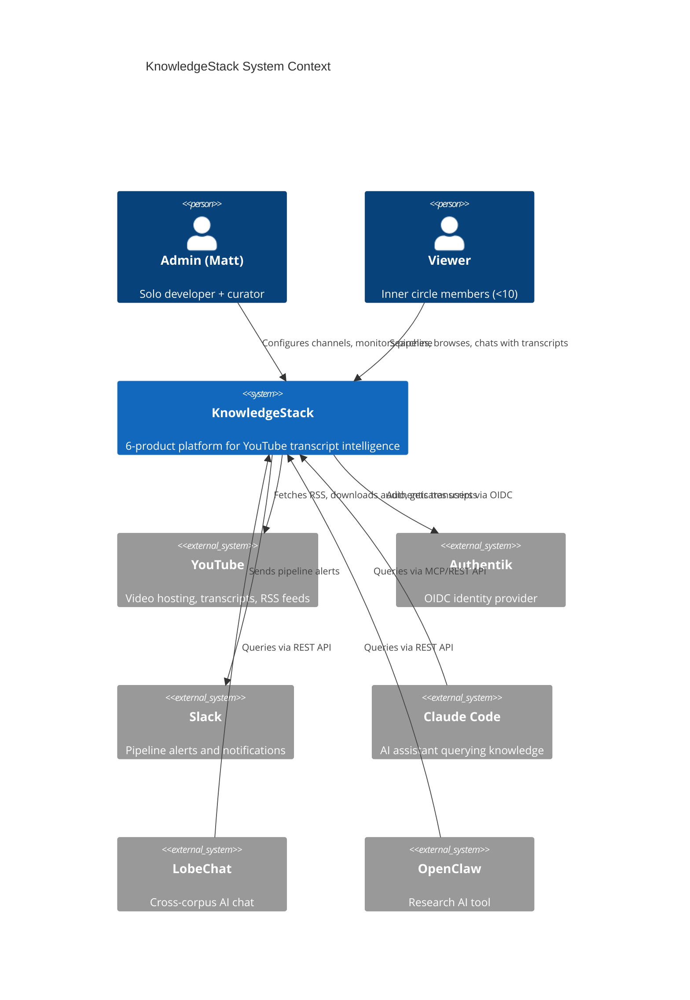

# System Context (C4 Level 1)

**Last Updated:** 2026-03-22

## System Context Diagram



## Actors

### Human Users

| Actor | Role | Interactions |
|-------|------|--------------|
| **Admin (Matt)** | Solo developer + curator | Configure channels, monitor pipeline, manage system, troubleshoot failures |
| **Viewers** | Inner circle members | Search transcripts, browse recordings, chat with content, tag/bookmark |

### External Systems

| System | Integration | Purpose |
|--------|-------------|---------|
| **YouTube** | RSS feeds, Data API v3, transcript API | Content source - video metadata, transcripts |
| **Authentik** | OIDC | User authentication, SSO |
| **Slack** | Webhook | Pipeline alerts, daily digests, failure notifications |

### Downstream AI Tools (Vision Phase)

| System | Protocol | Purpose |
|--------|----------|---------|
| **Claude Code** | MCP Server | AI assistant querying the knowledge repository |
| **LobeChat** | REST API | Cross-corpus AI chat over transcripts |
| **OpenClaw** | REST API | Research tool accessing structured knowledge |

## System Boundaries

### What KnowledgeStack Does

- Monitors YouTube channels for new content (RSS + API)
- Downloads and transcribes audio (WhisperX via Speakr)
- Stores transcripts with search and per-recording chat (Speakr)
- Enriches content with embeddings and entity extraction (SurrealDB)
- Provides operational visibility (n8n + Slack + Grafana)
- Exposes knowledge to external tools (REST API + MCP)

### What KnowledgeStack Does NOT Do

- Host video files (YouTube is the source)
- Provide public access (internal network only)
- Create transcripts for videos without captions (Gemini fallback deferred)
- Moderate content (curated sources only)

## Data Flows Summary

| Flow | Direction | Data |
|------|-----------|------|
| Ingestion | YouTube → KnowledgeStack | RSS items, metadata, transcripts |
| Search | Viewer ↔ KnowledgeStack | Queries, results, segments |
| Alerts | KnowledgeStack → Slack | Pipeline failures, digests |
| Auth | User ↔ Authentik ↔ KnowledgeStack | OIDC tokens |
| API Access | AI Tools ↔ KnowledgeStack | Structured queries, results |

## Trust Boundaries

```
┌─────────────────────────────────────────────────────────────┐
│ INTERNAL NETWORK (10.0.0.x)                                 │
│                                                             │
│  ┌───────────────────────────────────────────────────────┐ │
│  │ KnowledgeStack Platform                               │ │
│  │  - All 6 products run here                            │ │
│  │  - All data stays internal                            │ │
│  └───────────────────────────────────────────────────────┘ │
│                                                             │
│  ┌──────────────┐  ┌──────────────┐  ┌──────────────┐     │
│  │ Authentik    │  │ n8n          │  │ Grafana      │     │
│  │ (SSO)        │  │ (Workflows)  │  │ (Monitoring) │     │
│  └──────────────┘  └──────────────┘  └──────────────┘     │
└─────────────────────────────────────────────────────────────┘
          │                    │
          │                    │ HTTPS
          ▼                    ▼
┌─────────────────────────────────────────────────────────────┐
│ EXTERNAL SERVICES                                           │
│  YouTube, Slack, (future: LiteLLM cloud fallback)           │
└─────────────────────────────────────────────────────────────┘
```

## Context Scope Notes

- **MVP Scope**: Admin + Viewers interacting with Speakr, pipeline monitoring via Slack
- **Growth Scope**: Add Grafana dashboards, multi-user access
- **Vision Scope**: AI tool integration via KnowledgeGateway API/MCP
